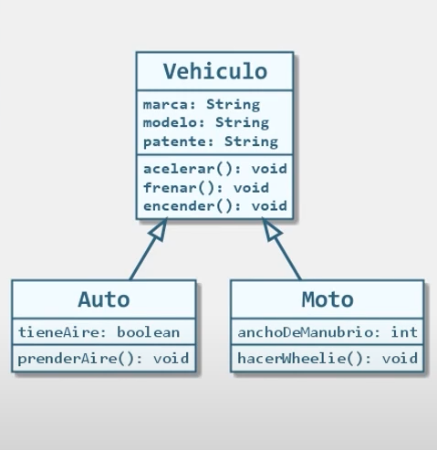

# 🧠 Ejercicio 1 - Herencia y Polimorfismo en Java ☕

Este proyecto tiene como objetivo aplicar los principios fundamentales de la **Programación Orientada a Objetos (POO)** en Java, enfocándonos especialmente en los conceptos de **Herencia**, **Encapsulamiento**, **Modificadores de Acceso** y el uso de **getters y setters**.

🧩 También usamos un diagrama UML como guía para construir una jerarquía de clases y comprender mejor la relación **“es-un” (is-a)** entre distintos tipos de vehículos.

---

## 📑 Tabla de Contenidos

- [📚 Contenido del Proyecto](#-contenido-del-proyecto)
- [🎯 Objetivos Didácticos](#-objetivos-didácticos)
- [📸 UML Utilizado](#-uml-utilizado)
- [🧪 Cómo probar el código](#-cómo-probar-el-código)
- [🔐 Nota sobre Encapsulamiento](#-nota-sobre-encapsulamiento)
- [📌 Conclusiones](#-conclusiones)
- [🔧 Requisitos](#-requisitos)

---

## 📚 Contenido del Proyecto

Este proyecto incluye una estructura básica de clases que simulan vehículos, donde se modelan comportamientos comunes y específicos utilizando herencia.

### 1. `Vehiculo.java`
Clase base que representa un vehículo genérico. Contiene:
- Atributos privados `marca`, `modelo` y `patente`.
- Métodos públicos como `acelerar()`, `frenar()` y `encender()`.
- Un método privado `chequearMotor()` que **no es heredado** directamente por las subclases.
- Métodos **getter y setter** para acceder a los atributos encapsulados.

### 2. `Auto.java`
Clase que **hereda** de `Vehiculo`. Agrega:
- Atributo `tieneAire`.
- Método `prenderAire()` que utiliza dicho atributo para realizar una acción específica.
- Getters y setters correspondientes.

### 3. `Moto.java`
Otra clase que **hereda** de `Vehiculo`. Agrega:
- Atributo `anchoDeManubrio`.
- Método `hacerWheliee()` que simula una acrobacia.
- Getters y setters para su atributo privado.

### 4. `Principal.java`
Clase que contiene el método `main`, donde:
- Se instancian objetos de las subclases `Auto` y `Moto`.
- Se configuran sus atributos mediante setters.
- Se accede a sus atributos con getters.
- Se demuestra la reutilización de métodos heredados.
- Se evidencia que los métodos privados de la superclase no son accesibles desde las subclases.
- Se hace uso de polimorfismo en la llamada a métodos comunes desde distintas clases hijas.

---

## 🎯 Objetivos Didácticos

- Comprender el concepto de **herencia** y cómo usarlo para modelar relaciones jerárquicas entre clases.
- Aplicar **encapsulamiento** para proteger atributos sensibles.
- Usar **modificadores de acceso** (`private`, `public`) para controlar la visibilidad y la seguridad del código.
- Practicar el uso de **getters y setters** como intermediarios para acceder y modificar atributos privados.
- Entender qué métodos y atributos **se heredan y cuáles no**.
- Observar la ejecución de métodos comunes y específicos en clases derivadas.

---

## 📸 UML Utilizado

Se partió de un diagrama UML simple con las siguientes relaciones:

Este diagrama ayuda a visualizar que tanto `Auto` como `Moto` **"son un"** tipo de `Vehiculo`.

---

## 🧪 Cómo probar el código

1. Asegurate de tener instalado Java JDK 17 o superior.
2. Cloná o descargá este repositorio.
3. Abrí tu IDE favorito (NetBeans, IntelliJ, VSCode).
4. Ejecutá la clase `Principal.java`.
5. Observá en la consola cómo:
    - Se instancian objetos de clases hijas.
    - Se usan métodos heredados y propios.
    - Se prueban getters y setters.
    - El método privado `chequearMotor()` se ejecuta **sólo internamente** dentro de la clase padre.

---

## 🔐 Nota sobre Encapsulamiento

Los atributos de la clase `Vehiculo` son privados, por lo tanto:
- **No pueden ser accedidos directamente** desde las subclases.
- Se deben usar métodos **getters y setters** para obtener o modificar sus valores.

Esto garantiza que las subclases respeten la integridad de los datos y promueve un código más seguro y mantenible.

---

## 📌 Conclusiones

Este ejercicio demuestra cómo Java permite construir sistemas robustos, reutilizables y jerárquicos mediante herencia. Además, refuerza buenas prácticas como el encapsulamiento y el uso adecuado de los modificadores de acceso.

> 🚀 “El futuro de la programación comienza aquí, y tú formas parte de él.”

---

## 🔧 Requisitos

- Java JDK 17 o superior
- IDE para Java (NetBeans, IntelliJ, VSCode, etc.)
